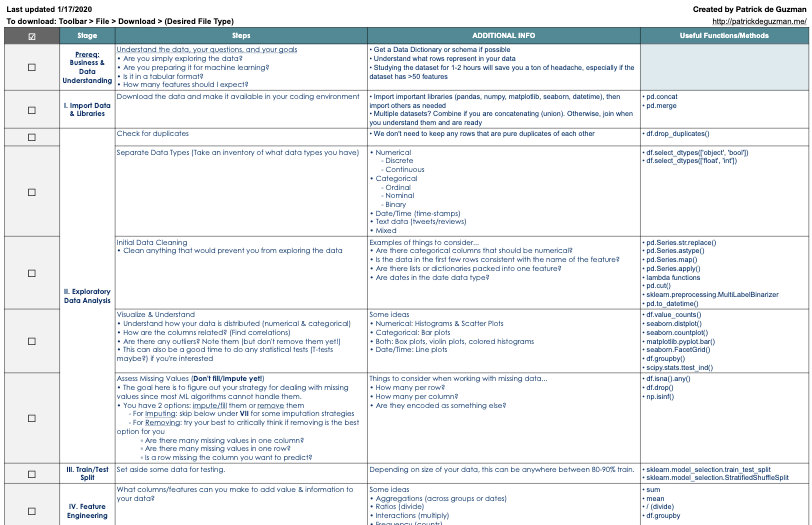
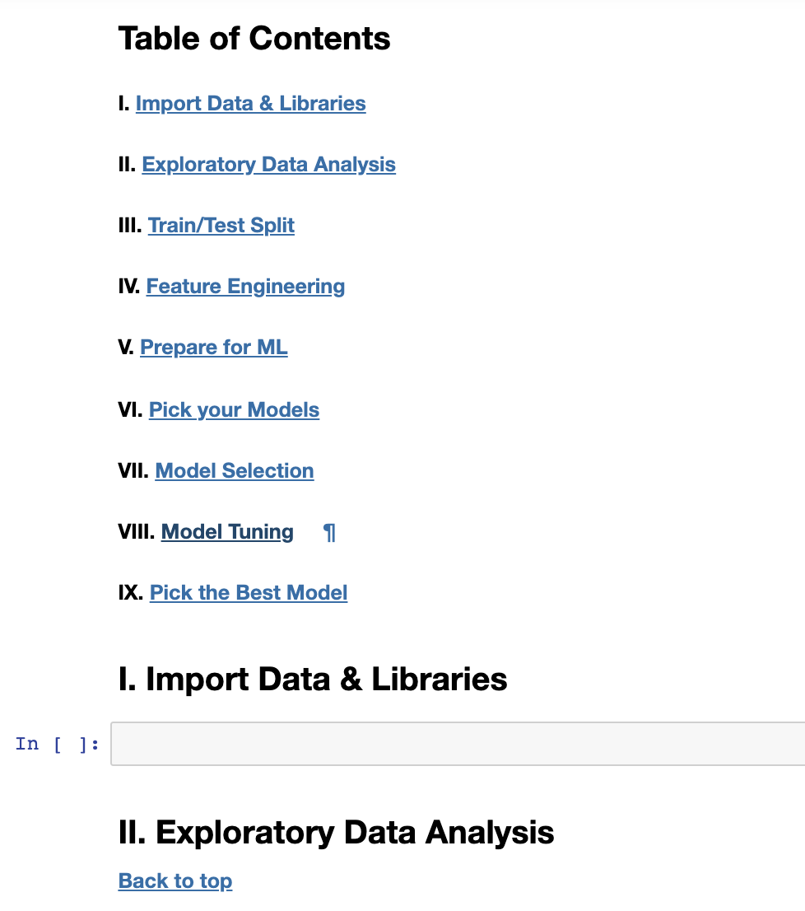

## Machine Learning Project Checklist

**Summary:** [This checklist](http://bit.ly/ml_proj_checklist) was created to help ML students/practitioners structure their projects and problems in a way that makes sense to me.

---

When I just got started learning Python for Machine Learning and worked on my first few projects, I found it very overwhelming because...
- it was difficult to remember all of the steps I needed to take in order to make my data ML-friendly,
- I couldn't easily remember the functions, methods, and estimators from pandas, numpy, and sklearn, and
- it was tedious and time-consuming to try to understand large (>50 feature) datasets

So, I created the [ML checklist](http://bit.ly/ml_proj_checklist) (Pictured Below) to be a handy tool for whenever I start to feel lost creating an ML project.

In this repo, I also created...
1. `ml_project_checklist_template.ipynb`: (Pictured below) a Jupyter .ipynb that you can use as a template for your project or Kaggle competition
2. `data_cleaning_for_ml_lab_EXERCISES.ipynb`: An exercises/lab that you can finish for data cleaning practice, originally made for a workshop that I gave
3. `data_cleaning_for_ml_lab_SOLUTIONS.ipynb`: A solutions file for the exercises I give above
4. `boston.csv` and `cambridge.csv`: Airbnb datasets from [here](http://insideairbnb.com/get-the-data.html) used for the exercises
5. I also included a PDF version of the checklist.

---

I hope you find these resources as useful as I do!

Happy learning :). 